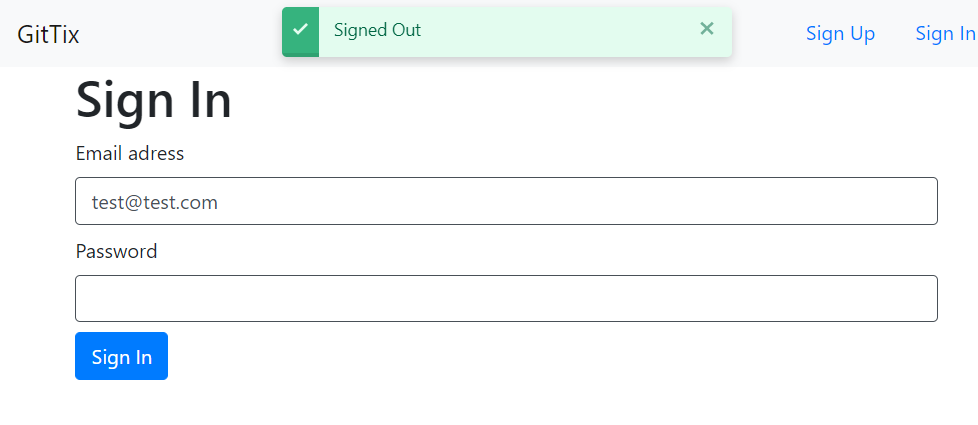

<h1 align="center">Ticketing Microservices 👋</h1>
<p>
  
  <a href="https://github.com/YemreAybey/Tickets_Microservices#readme" target="_blank">
    
  </a>
  <a href="https://github.com/YemreAybey/Tickets_Microservices/commit-activity" target="_blank">
    
  </a>
  <a href="https://twitter.com/YunusAybey" target="_blank">
    
  </a>
</p>

<p align="center">
  
</p>

<p align="center">
  
</p>

<p align="center">
  
</p>

<br>

This project is created by following the tutorial of [Stephen grider](https://github.com/StephenGrider).
The aim of the project is using microservices along with docker and kubernetes. Instead of copying everything from the tutorial, I added some features myself to contribute and learn more. On the client part, I have added client-side form validation without waiting backend response which is not included in the course. In addition, I have added toast feature so that users will be informed instantly after every action they take. Also I have added free ssl certificate and mailing service (sends mail whenever you buy a ticket) as stephen reccommends at the end of the course. Lastly all the code is send in dev mode to production, I changed that and now every service is running in production mode. You can find the original tutorial here: [Microservices by Stephen Grider](https://www.udemy.com/course/microservices-with-node-js-and-react/)

## Backend

For the backend I have created 6 different services for every module in the app. These modules are:

- Auth Service (Login - Logout - Signup)
- Tickets Service (handling all ticket related activities like creating and storing them)
- Orders (handling everything related to orders)
- Payments (handling payments with stripe)
- Expiration Service (Responsible for emiting an event when the order expires)
- Mail Service (Sends a mail everytime you buy a ticket)

## Built With

- NextJS - React/Hooks
- NodeJS
- ExpressJs
- Typescript
- MongoDB
- NATS streaming server
- Redis
- Docker
- Kubernetes

### ✨ [Live Demo](https://www.ticketing-emre-aybey-prod.xyz/)


## Pre-Usage


You need to make sure you have installed this technologies into your local computer before trying to run all the code.

- Chocolatey (This is needed to install skaffold only for windows - Just google it and install).
- Skaffold [Install from here](skaffold.dev/docs/install)
- Docker desktop - Don't forget to signup and login with your account to docker-desktop [check here to install it](https://docs.docker.com/get-docker/)
- Kubernetes (It comes with Docker-Desktop. Just find and click the docker system tray icon. Click on and go to preferences or settings. On the side you will find kubernetes tab click on it. Go check the box says Enable kubernetes and click the button that says Apply & Restart. You are done perfect 🥇).
- Typescript (Just run npm i typescript -g)


Quick Note: If you are not able to use docker desktop and using docker toolbox. This steps will not be enough for you.


## Usage

> Clone the repository to your local machine

```sh
$ git clone https://github.com/YemreAybey/Tickets_Microservices.git
```

> Cd into the root folder and change every emre1720 to your docker username instead. Just search from your editor the word emre1720 and change it with your docker username.

> Now I am using some secret variables like my email password or jwt signing process. To create yours check every depl.yaml file inside infra/k8s if you see something like:

```sh
secretKeyRef:
  name: jwt-secret
  key: JWT_KEY
```

> This means that a secret is used here. You need to find every sevret and create it with command in below from anywhere in your terminal. you can change the value by changing `anyvaluehere`. Once you create your secret you can use the same secret in any service. So if you created jwt-secret once you do not have to create it again. If you created all the secrets go to next step.


```sh
$ kubectl create secret generic jwt-secret --from-literal=jwt=anyvaluehere
```

> You will see that I gave my mail adress inside the mail service. If you want to use the mail service you must specify your own email adress and password(remember you need the secret to use ypur pass or just type it if you are not gonna publis the code). So go to mail service inside src/mailer/index find `'emre.aybey@pabeda.com.tr'` and change it to your mail adress. after that you can go to next step.


> You need the first time build and push the images to the docker. To do that, cd into every service(only to folders mentioned above inside Backend) one by one. And run theese commands for every service. The dot(.) that you see at the and of the first command is really needed do not forget it. and don't for get to run theese commands for each service.

```sh
$ cd tickets
$ docker build -t your-docker-username/tickets .
$ docker push your-docker-username/tickets
```


> Now open the hosts file as administator. You can see the path from the picture under. Got to bottom of the file and add this(do not delete anything just add this at the end of the file save it and close it):

```sh
$ 127.0.0.1 ticketing.dev
```

<p align="center">
  
</p>

> cd back into the root and run

```sh
$ cd ../
$ skaffold dev
```

> After skaffold is done open `ticketing.dev` from your browser and if you see something like your connection is not private just click anywhere in the page and type thisisunsafe after typing this hit enter and you are good to go.

## :eyeglasses: Authors

👤 **Y.Emre AYBEY**

- Github: [@YemreAybey](https://github.com/YemreAybey)
- Twitter: [@YunusAybey](https://twitter.com/YunusAybey)

## 🤝 Contributing

Contributions, issues and feature requests are welcome!<br />Feel free to check [issues page](https://github.com/YemreAybey/Tickets_Microservices/issues).

1. Fork it (https://github.com/YemreAybey/Tickets_Microservices.git/fork)
2. Create your working branch (git checkout -b [choose-a-name])
3. Commit your changes (git commit -am 'what this commit will fix/add/improve')
4. Push to the branch (git push origin [chosen-name])
5. Create a new Pull Request

## ⛲ Future of the app

1. UI is so bad. Just need better designs.
2. There is no profile section for users. There should be and users should be able to upload tehir profile pictures.
3. Maybe users can be friends and whenever a user buys a ticket an information can be send to all friends(If the user allowed the feature).

Contributions, issues and feature requests are welcome!<br />Feel free to check [issues page](https://github.com/YemreAybey/Tickets_Microservices/issues).

1. Fork it (https://github.com/YemreAybey/Tickets_Microservices.git/fork)
2. Create your working branch (git checkout -b [choose-a-name])
3. Commit your changes (git commit -am 'what this commit will fix/add/improve')
4. Push to the branch (git push origin [chosen-name])
5. Create a new Pull Request

## Show your support

Give a ⭐️ if you like this project!

